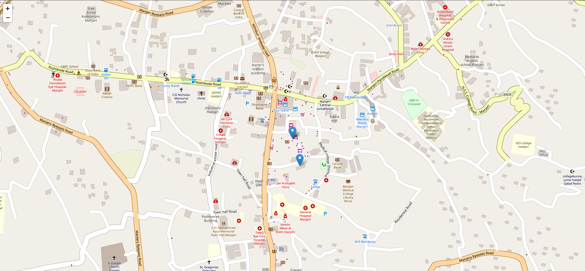

# Live Location Tracker App

## Description

The Live Location Tracker App is built using Express.js, Node.js, Socket.IO, Leaflet, and EJS. It allows users to track live locations in real-time on an interactive map.

## Technologies Used

- **Express.js**: A web application framework for Node.js, used to build the server-side application.
- **Node.js**: A JavaScript runtime built on Chrome's V8 JavaScript engine, used to run the server.
- **Socket.IO**: A library for real-time web applications, used for real-time, bi-directional communication between web clients and servers.
- **Leaflet**: An open-source JavaScript library for mobile-friendly interactive maps.
- **EJS**: A simple templating language that lets you generate HTML markup with plain JavaScript.
